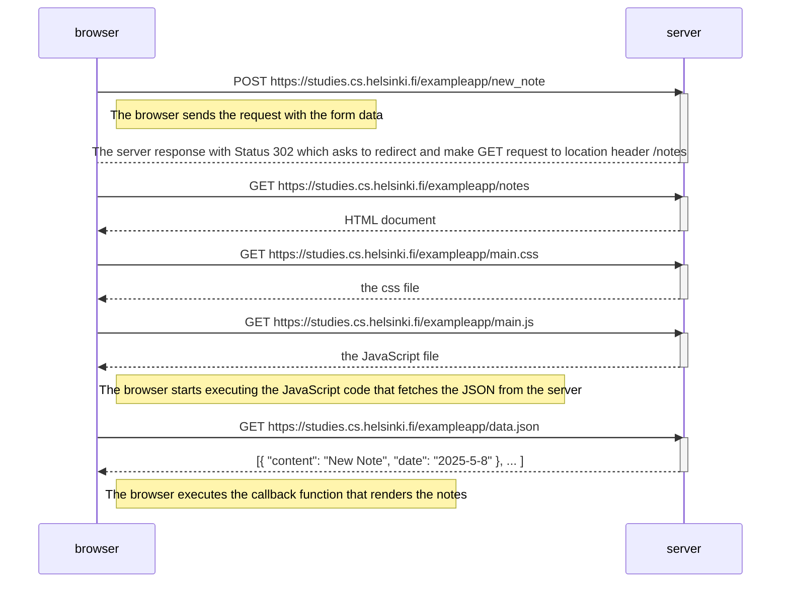
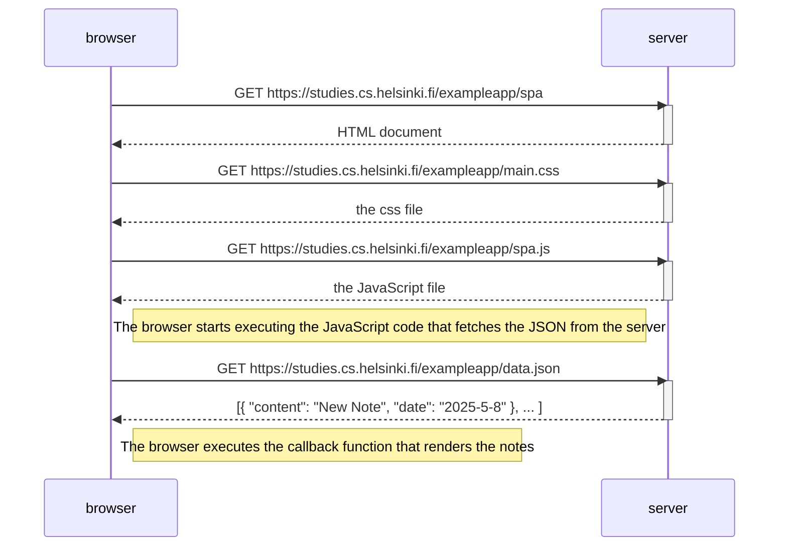
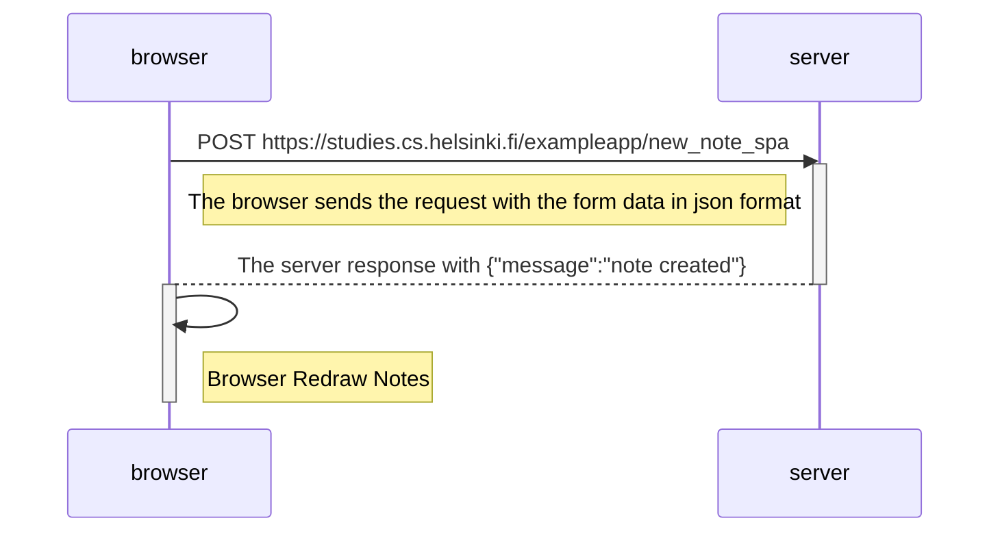

# Exercises
These exercises focus on modeling the communication flow between the browser and the server during web requests. They cover both classic web communication patterns and those used in Single Page Applications (SPAs).

In traditional (classic) web applications, the browser sends a request to the server, which responds by sending back an entirely new HTML page. The browser then replaces the current page with the new one.
In contrast, Single Page Applications avoid full-page reloads. Instead, they send asynchronous requests (e.g., using XMLHttpRequest or fetch) to the server to retrieve data. The browser then updates the DOM dynamically using JavaScript, resulting in a smoother, more responsive user experience.
These exercises help you understand and model these interactions using diagrams and structured observations of browser–server communication.

## Sample Exercise Diagram

## 0.4: New note diagram

## 0.5: Single page app diagram

## 0.6: New note in Single page app diagram

